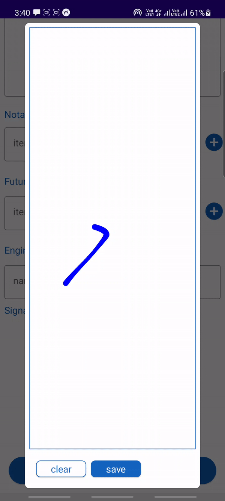
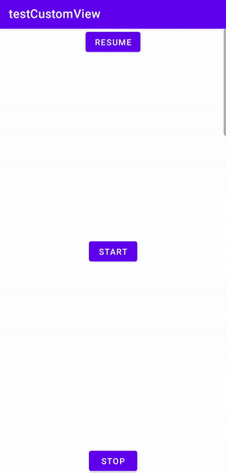
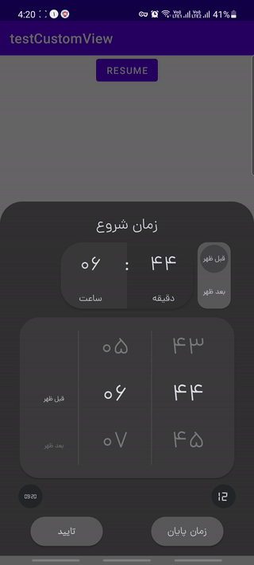
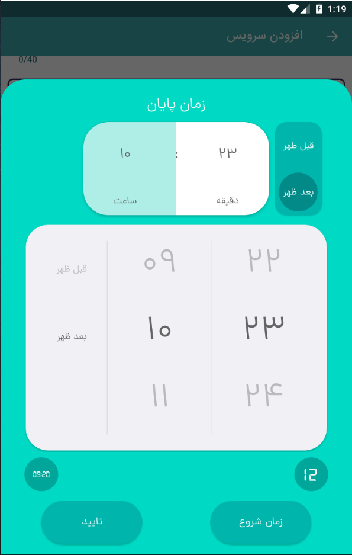
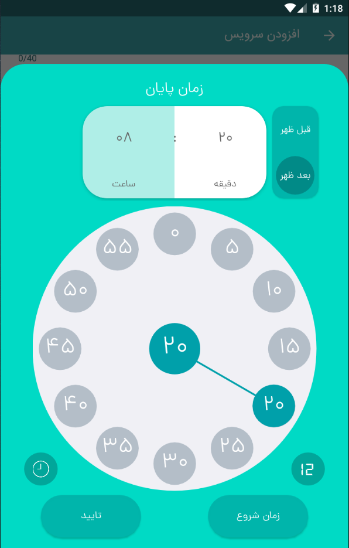
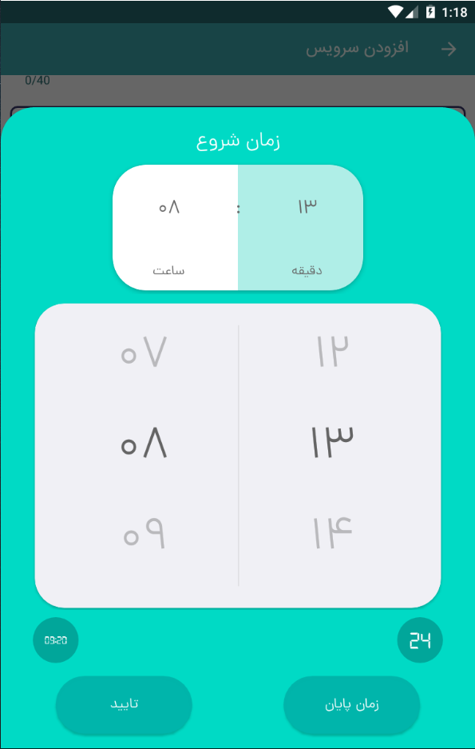
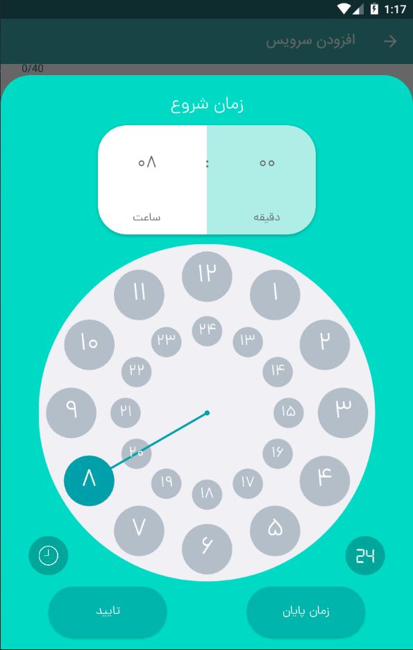
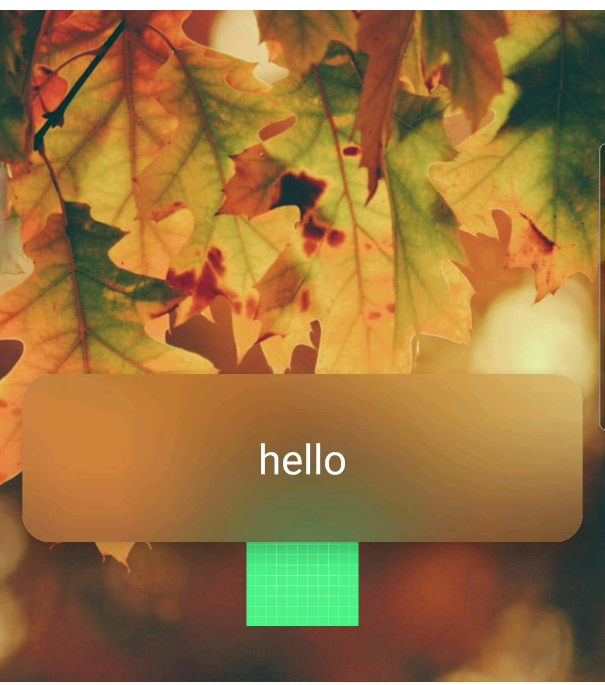

# نمونه کار یک
<table>
 <tr>
  
 </tr>
 <tr>
  
 </tr>
 </table>

|  1  | 2 |
| ------------- | ------------- |
|   |   |

 این یک ویو شخصی است که در قسمت بالا قرار گرفته و به کار جلوه ی یک موج را می دهد.
* use of custom view
* use of cos and sin (Math)
* with xml
* can writed by jetpack compose

# نمونه کار دوم

در این قسمت فضایی برای امضا کردن ایجاد شده است که بنده به طور کامل آن را طراحی کرده ام. 
خطوط قابلیت نازک و پهن شدن را دارند و برای انحنای خطوط از منحنی های بیزیر * استفاده شده است
* use of bezier curve (Math)
* انحنای خطوط
* بهینه بودن و لگ نداشتن برنامه
* نازک و پهن شدن خطوط
باعث زیبایی این طراحی شده است
* writed with jetpack compose

# time range time picker

|  1  | 2 |
| ------------- | ------------- |
|   |   |

<table>
  <tr>
        <th>Attribute</th>
        <th>Analog</th>
        <th>Digital</th>
    </tr>
  <tr>
    <td>
      <b>12 Hour</b>
    </td>
    <td>
        
    </td>
    <td>
        
    </td>
  </tr>
  <tr>
    <td>
      <b>24 Hour</b>
    </td>
    <td>
        
    </td>
    <td>
        
    </td>
  </tr>
</table>
 

- این یک تایم رنج پیکر هست که با سعی و تلاش فراوران توسط بنده طراحی شده است 
- ما این را به شکل یک کتابخانه در آوردیم و می توان آن را با رنگ ها و طرح های مختلفی شخصی سازی کرد.
- بسیاری از اجزای ان به صورت اختصاصی طراحی شده

# BluerCardView
 
